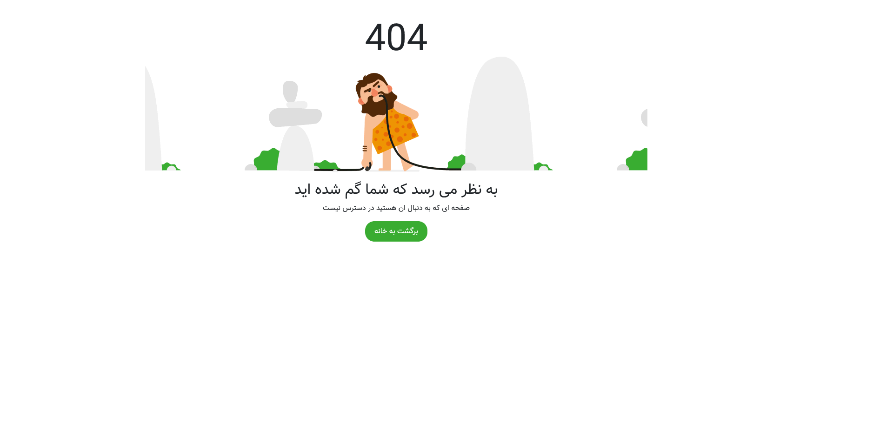

<div align="center">
  <h2 align="center">Not Found Page</h2>
  
  This Theme is fully responsive for all devices, <br/> Built using HTML, CSS and Bootstrap.
  
  <a href="https://cymilad.ir/projects/not-found-page" target="_blank"><strong>➥ Live Demo</strong></a>
  
</div>


<br />

### Demo Screeshots 🖼️



### Prerequisites

Before you begin, ensure you have met the following requirements:

* <b>Windows</b> :  [Git](https://git-scm.com/downloads "Download Git") must be installed on your operating system.
* <b>Linux and macOS</b> :  apt-get install git

### Run Localhost

To run **not-found-page** locally, run this command on your git bash:

Linux 🐧 and macOS 🍏:

```bash
sudo git clone https://github.com/cymilad/not-found-page.git
```

Windows 🪟:

```bash
git clone https://github.com/cymilad/not-found-page.git
```

### Contact 💬 
Telegram : <a href="https://t.me/cymilad" target="_blank"><strong>cymilad</strong></a> <br>
Instagram : <a href="https://instagram.com/cymilad" target="_blank"><strong>cymilad</strong></a> <br>
Twitter : <a href="https://x.com/cymilad" target="_blank"><strong>cymilad</strong></a> <br>
Email : <a href="malito:milad1418@yahoo.com" target="_blank"><strong>milad1418@yahoo.com</strong></a>

### License 🪪

This project is **free to use** and does not contains any license.
